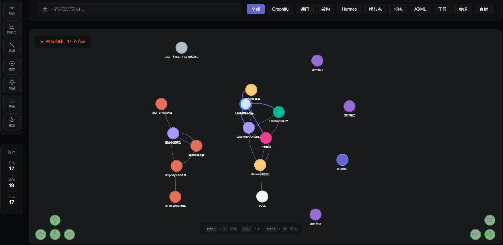
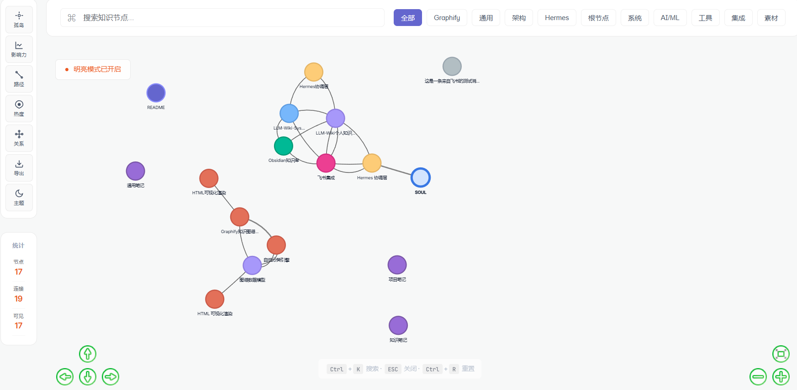
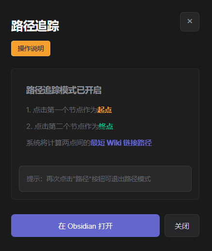
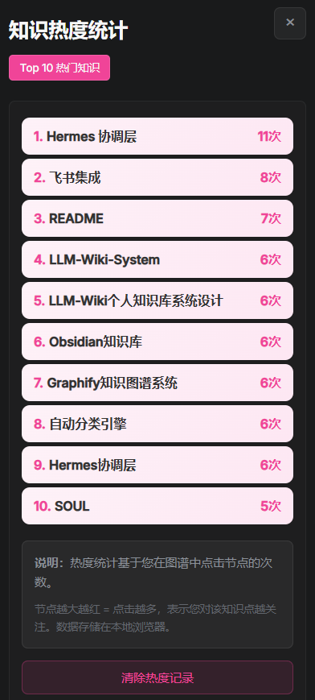

<div align="right">

**[English](README_EN.md)** | 中文

</div>

# obsidian-graphify

**将你的 Obsidian 笔记变成一张可视化的知识图谱，让知识真正「连起来」。**

[](LICENSE)
[](https://www.python.org/)
[](https://obsidian.md/)
[](https://github.com/visjs/vis-network)

***

## 核心理念

```
笔记 → 解析链接 → 构建图谱 → 可视化 → 发现脉络 → 建立新链接 → 笔记
```

一个正向循环。写得越多，图谱越密；图谱越密，发现越多。

***

## 系统架构


**核心组件**：

| 层级 | 组件 | 功能 |
|:---|:---|:---|
| 输入层 | 飞书/微信/原创 | 外部内容来源 |
| 协调层 | Hermes Agent | 消息接收、分类路由、审批执行 |
| 处理层 | note_collector | 分析 → 分类 → 格式化 |
| 处理层 | wiki_link_builder | 关键词匹配 → Wiki链接建立 |
| 处理层 | update_graph_html | 扫描Vault → 生成图谱数据 |
| 存储层 | Obsidian Vault | 笔记持久化存储 |
| 展示层 | graph.html | vis-network 可视化交互 |

***

## v2.4.0 新特性

### 🚀 自动化收录流程

一键完成：**分析 → 分类 → 格式化 → Wiki链接 → 图谱更新 → 浏览器展示**

```bash
# 收录微信文章
python3 skills/scripts/note_collector.py \
  --title "文章标题" \
  --content "文章内容" \
  --source "wechat" \
  --author "作者名"
```

### 📝 简化模板格式

YAML 从 17 行精简到 4 行，正文直接呈现：

```markdown
---
type: original
created: 2026-04-19
tags: ["标签1", "标签2"]
---

# 笔记标题

> 一句话核心观点。

正文段落...

---

正文段落（段落间用 --- 分隔）...

## 关键概念

- **概念名** → 简要解释

---

## 相关笔记

- [[笔记名]] (关联理由)

---
```

### 🔗 Wiki 链接自动建立

基于关键词和语义匹配，自动关联相关笔记：

```bash
python3 skills/scripts/wiki_link_builder.py "/path/to/note.md"
```

### 🏝️ 知识孤岛检测

找出无 Wiki 链接的笔记，并基于关键词建议可能的连接：

```bash
python3 skills/scripts/island_detector.py "/path/to/vault" --suggest
```

### 📋 笔记质量检查

检查 YAML frontmatter 完整性和格式规范性：

```bash
python3 skills/scripts/quality_checker.py "/path/to/vault"
```

### 🕸️ 图谱网络分析

分析笔记网络的中心性、桥梁节点和知识簇：

```bash
python3 skills/scripts/graph_analyzer.py "/path/to/vault"
```

***

## 为什么做这个

传统笔记软件只解决「存储」问题：文件夹、标签、搜索。但没有解决「连接」问题。

当你有 10 条笔记时，可以靠记忆知道它们的关系。
当你有 50 条笔记时，就会开始遗忘。
当你有 100+ 条笔记时，它们自然就成了孤岛。

而 Graphify，就是把单个的笔记，变成一张知识网络：

- **可视化** — 一张图看清所有知识
- **路径追踪** — BFS 最短路径，发现知识脉络
- **孤岛检测** — 高亮无连接节点，知道哪里需要补链接
- **热度统计** — 点击记录，显示你最关注的领域
- **影响力分析** — PageRank 式排名，知道哪个知识点是你的核心
- **自动化收录** — 一键完成收录全流程

***

## 从存储到连接

| 传统笔记软件 | Graphify | 为什么这样设计 |
| :------ | :------- | :------------------- |
| 文件夹树状结构 | 网状图谱 | 知识本来就是网状的 |
| 搜索关键词 | 点击节点直达 | 搜索需要知道关键词，图谱可以发现不知道的 |
| 标签分类 | 动态分类筛选 | 分类是静态的，图谱是动态生长的 |
| 笔记是孤岛 | 笔记是节点 | 孤岛之间没有路，节点之间有路径 |
| 靠记忆找关联 | 路径追踪算法 | 记忆会遗忘，算法不会 |
| 手动整理格式 | 自动化收录 | 重复工作交给脚本 |

***

## 17 个核心功能

| # | 功能 | 说明 |
| :- | :---------- | :-------------------------- |
| 01 | **3级文件夹结构** | 原创/收藏分离，结构化管理笔记 |
| 02 | **可视化图谱** | vis-network 渲染，一张图看清所有知识网络 |
| 03 | **快速搜索** | Ctrl+K 秒级定位任意节点 |
| 04 | **分类筛选** | 动态渲染按钮，自动同步笔记分类 |
| 05 | **路径追踪** | BFS 最短路径，发现知识脉络 |
| 06 | **热度统计** | localStorage 点击记录，显示你最关注的领域 |
| 07 | **孤岛检测** | 高亮无连接节点，发现需要建立链接的内容 |
| 08 | **影响力分析** | PageRank 式排名，知道哪个知识点最核心 |
| 09 | **主题切换** | 深色/浅色模式，Linear 设计风格 |
| 10 | **飞书导入** | 自动保存有价值消息到笔记库 |
| 11 | **PNG 导出** | 保存图谱图片，分享知识结构 |
| 12 | **自动更新** | watchdog 监控，实时同步图谱 |
| 13 | **自动化收录** | 一键完成收录全流程 |
| 14 | **Wiki 链接建立** | 自动关联相关笔记 |
| 15 | **孤岛检测工具** | 命令行检测无连接笔记并建议连接 |
| 16 | **质量检查工具** | 检查 YAML 完整性和格式规范 |
| 17 | **图谱分析工具** | 分析中心性、桥梁节点、知识簇 |

***

## 技术栈

| 组件 | 技术 | 为什么选它 |
| :--- | :------------------ | :------------ |
| 可视化 | vis-network v9.1.9 | 轻量、高性能、支持物理模拟 |
| 设计风格 | Linear.app | 深色/浅色主题，干净现代 |
| 后端 | Python 3.x | 简单、跨平台、易扩展 |
| 自动更新 | watchdog | 文件监控，实时响应 |
| 集成 | Obsidian URI scheme | 点击节点直接打开笔记 |
| 存储 | localStorage | 无需数据库，纯本地 |
| 自动收录 | note_collector.py | 分析、分类、格式化、链接、更新 |

***

## 安装前提

| 前置条件 | 版本要求 | 检查方式 | 说明 |
| :----------- | :--- | :------------------ | :--- |
| **Obsidian** | 任意版本 | 已安装并有一个 vault | 笔记软件 |
| **Python** | 3.6+ | `python3 --version` | 运行脚本 |
| **pip** | 任意 | `pip3 --version` | 安装依赖 |
| **Git** | 任意 | `git --version` | 克隆仓库 |

> 💡 **仓库地址**: `https://github.com/Chandlersn/obsidian-graphify`

***

## 快速开始

### 一键安装（推荐）

```bash
# 克隆仓库
git clone https://github.com/Chandlersn/obsidian-graphify.git
cd obsidian-graphify

# 运行安装脚本
chmod +x scripts/install.sh
./scripts/install.sh
```

安装过程中会提示你输入 Obsidian vault 路径。

### 收录文章

```bash
# 收录原创内容
python3 skills/scripts/note_collector.py \
  --title "我的思考" \
  --content "正文内容..." \
  --source "user"

# 收录微信文章（会询问处理方式）
python3 skills/scripts/note_collector.py \
  --title "文章标题" \
  --content "文章内容..." \
  --source "wechat" \
  --author "作者名"
```

### 更新图谱

```bash
# 更新图谱
python3 src/update_graph_html.py "/path/to/vault"

# 打开浏览器
# Windows (WSL)
cmd.exe /c start "" "D:\\vault\\.graphify\\graph.html"
# macOS
open /path/to/vault/.graphify/graph.html
```

***

## 文件结构

```
obsidian-graphify/
├── README.md              # 本文件
├── LICENSE                # MIT License
├── CHANGELOG.md           # 版本历史
├── assets/
│   └── screenshots/       # 截图演示
├── config/
│   └── config.yaml        # 配置文件
├── demo_notes/            # 示例笔记
├── docs/                  # 详细文档
│   ├── getting-started.md
│   ├── folder-structure.md
│   ├── features.md
│   ├── metadata-spec.md   # v2.2 元数据规范
│   └ customization.md
│   └ troubleshooting.md
├── scripts/
│   └ install.sh           # 安装脚本
├── skills/
│   ├── SKILL.md           # Agent Skill 定义 v2.4
│   └ scripts/
│       ├── note_collector.py    # 核心收录脚本
│       ├── wiki_link_builder.py # Wiki 链接建立
│       ├── update_graph_html.py # 图谱生成
│       ├── island_detector.py   # 孤岛检测
│       ├── quality_checker.py   # 质量检查
│       ├── graph_analyzer.py    # 图谱分析
│       └ graphify.sh           # 快捷入口
└── src/
    ├── graph.html         # 图谱页面
    ├── templates/
    │   └ 笔记模板.md      # 简化模板（唯一）
    └ feishu_importer.py   # 飞书导入
    └ auto_update.py       # 自动更新守护进程
```

***

## 推荐的 Vault 结构

### AI时代哲学知识系统结构（实际应用）

```
obsidian-notes/
├── index.md                      # 总目录（纯粹导航）
├── SOUL.md                       # 哲学灵魂（成长指导思想）
├── SOUL-定位说明.md              # SOUL文档定位说明
├── README.md                     # 系统总览
│
├── 原文笔记/                      # 原始素材（未处理）
│   └── [原始思考记录]
│
├── 处理过的笔记/                  # 高质量分类体系
│   ├── 01-哲学思想/              # 10篇高质量哲学文档
│   ├── 00-系统文档/              # 架构支撑文档
│   ├── 02-技术实践/              # 待填充
│   ├── 03-生活思考/              # 待填充
│   └── 04-项目工作/              # 待填充
│
└── .graphify/                    # 知识图谱可视化
    └── graph.html                # 交互式知识网络
```

### 核心设计理念

| 设计原则 | 实现方式 | 效果 |
|---------|---------|------|
| **简洁至上** | 元数据最多7个字段 | 5秒内抓住重点 |
| **质量优先** | 对标标杆文档（92-95分） | 思想深度，语言力量 |
| **系统生长** | 原文→处理→高质量文档 | 知识网络持续扩展 |
| **Wiki连接** | 双向链接，知识图谱 | 38节点，100边 |

### 传统结构（兼容）

```
obsidian-notes/
├── 01-System/          # 系统核心
├── 02-Knowledge/       # 知识领域
│   ├── Wisdom/         # 智慧、认知、哲学
│   ├── AI-ML/          # AI、机器学习
│   ├── Architecture/   # 架构、系统设计
│   └ Tools/            # 工具、技巧
├── 03-Projects/        # 项目文档
├── 04-Materials/       # 收藏素材
│   ├── Articles/       # 外来文章
├── 05-Templates/       # 笔记模板
└── .graphify/          # 图谱系统
```

***

## 截图

| 深色主题 | 浅色主题 |
| :---------------------------------------: | :-----------------------------------------: |
|  |  |

| 路径追踪 | 热度统计 |
| :------------------------------------------: | :--------------------------------------: |
|  |  |

***

## 文档

- [快速开始](docs/getting-started.md) — 详细安装指南
- [文件夹结构](docs/folder-structure.md) — 3 级结构设计理念
- [功能详解](docs/features.md) — 14 个功能完整说明
- [元数据规范](docs/metadata-spec.md) — v2.2 简化模板格式
- [自定义配置](docs/customization.md) — 修改颜色、字体、分类
- [常见问题](docs/troubleshooting.md) — FAQ

***

## 实际应用案例

### AI时代哲学知识系统

**项目背景**：一个基于Obsidian构建的哲学知识管理系统，遵循"我存在即价值"的核心理念。

**应用成果**（2026-05-02）：

| 指标 | 数据 | 说明 |
|------|------|------|
| **哲学文档** | 10篇 | 1篇标杆（100分）+ 8篇优化（92-95分）+ 1篇待优化（85分）|
| **知识节点** | 38个 | 从18个增长到38个（+111%）|
| **Wiki连接** | 100条 | 从22条增长到100条（+355%）|
| **健康度** | 65.8% | 有Wiki连接的笔记比例 |
| **质量提升** | +8.6分 | 8篇文档平均质量提升幅度 |

**批量优化成果**：

```
沟通的艺术: 84 → 95 (+11)
别再囤知识了: 78 → 92 (+14)
这个世界最大的悲剧: 82 → 93 (+11)
人的认知转变: 89 → 94 (+5)
真正的智慧从何而来: 87 → 93 (+6)
创造力如何才能拥有: 86 → 93 (+7)
你的认知体系: 84 → 92 (+8)
客观时间与意识时间: 85 → 92 (+7)
```

**核心理念落地**：
- **简洁至上**：元数据最多7个字段，5秒内抓住重点
- **质量优先**：所有哲学文档对标标杆标准（92-95分）
- **系统生长**：基于哲学指导的系统迭代，从原文笔记→处理过的笔记→高质量文档

**项目地址**：[obsidian-graphify](https://github.com/Chandlersn/obsidian-graphify)

***

## 设计灵感

> "Knowledge is a network, not a hierarchy."
> — Ted Nelson, Hypertext Pioneer

Graphify 把 Ted Nelson 的超文本理念落地到 Obsidian：

- **双向链接** — `[[笔记名]]` 创建节点和边
- **可视化** — 把隐藏的网络变成可见的图谱
- **发现** — 路径追踪、孤岛检测、影响力分析
- **自动化** — 收录、格式化、链接、更新一键完成

***

## 贡献指南

欢迎贡献！

```bash
# 1. Fork 并克隆
git clone https://github.com/Chandlersn/obsidian-graphify.git

# 2. 创建分支
git checkout -b feature/your-feature

# 3. 提交更改
git commit -m "Add: your feature"

# 4. 推送并创建 PR
git push origin feature/your-feature
```

***

## 许可证

MIT License — 自由使用、修改、分发。

***

## 版本历史

| 版本 | 日期 | 核心更新 |
| :--- | :--- | :------- |
| **v2.5.0** | 2026-05-02 | 批量优化8篇文档（平均+8.6分）、知识网络扩展（38节点100边）、质量标准建立 |
| **v2.4.0** | 2026-04-24 | 孤岛检测、质量检查、图谱分析工具、Wisdom金色分组 |
| **v2.2.0** | 2026-04-19 | 弹窗Wiki链接显示、模板同步更新 |
| **v2.1.0** | 2026-04-19 | 修复代码截断、补全graphify.sh、分类规则配置化、demo_notes完善 |
| **v2.0.0** | 2026-04-16 | 简化模板格式、自动化收录流程、Wiki链接自动建立 |
| **v1.0.0** | 2026-04-16 | 首个稳定版本：14个核心功能、完整文档体系 |
| **v0.9.0** | 2026-04-15 | Beta版本：基础图谱可视化、简单筛选 |

详见 [CHANGELOG.md](CHANGELOG.md)

***

<div align="center">

**让知识从孤岛变成网络。**

*写得越多，图谱越密；图谱越密，发现越多。*

</div>